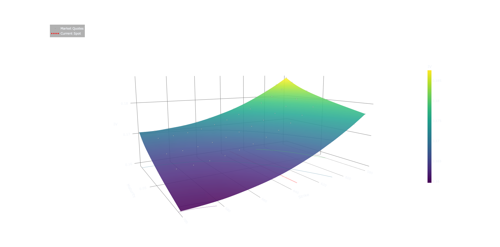

# 📈 Options Pricing Engine

> Reconstructing the geometry of implied volatility from real option-chain data.

## Architecture

### C++ Pricing & Data Layer

The core engine is implemented in C++ for control over performance, memory layout, and numerical stability.

**Key components:**

- **HTTP Layer**
  - `libcurl` for synchronous API requests
  - custom write callbacks for streaming responses into buffers

- **Parsing Layer**
  - `nlohmann::json` for structured extraction
  - transforms raw responses → normalized records

- **Data Structures**
  - compact structs (`RawOptionRecord`, `OptionRecord`)
  - contiguous `std::vector` storage for cache-friendly iteration
  - minimal heap allocations in hot paths

- **Pipeline Flow**
```

API → JSON → Raw Records → Filter → IV Solve → Surface Data

```

---

### Implied Volatility Solver

Numerically solves:

```

BS(σ) - market_price = 0

```

Using **Newton–Raphson iteration**:

- analytical Vega for fast convergence  
- update step:
```

σ_{n+1} = σ_n - f(σ)/Vega

```
- safeguards:
- tolerance-based stopping
- iteration caps
- protection against low-vega instability

Designed to remain stable near:
- short maturities  
- deep ITM / OTM regions  

---

### Data Conditioning

Real option data is noisy. The pipeline explicitly removes:

- near-zero premium contracts  
- deep OTM strikes with unstable IV  
- inconsistent or illiquid quotes  

Filtering is applied **before interpolation**, which is critical to preserving surface structure.

---

### Surface Reconstruction

- sparse market quotes are lifted into a continuous domain  
- cubic interpolation over `(strike, maturity)`  
- upsampled to a **100 × 100 grid**

This produces a surface that is:
- smooth  
- continuous  
- visually interpretable  

while still grounded in real observations.

---

## Visualization (Plotly)

The surface is rendered using a high-resolution grid and structured for clarity:

- cubic interpolation (`scipy.interpolate.griddata`)
- dense mesh (100×100)
- contour projection to expose curvature
- low-opacity markers → raw market quotes
- projected spot line → anchors surface in price space

This avoids:
- noisy scatter-only plots  
- over-smoothed surfaces with no ground truth  

---

## Example Output



> SPY implied volatility surface (March 27, 2026 snapshot)  
> Interpolated from cleaned quotes with raw observations overlaid.
